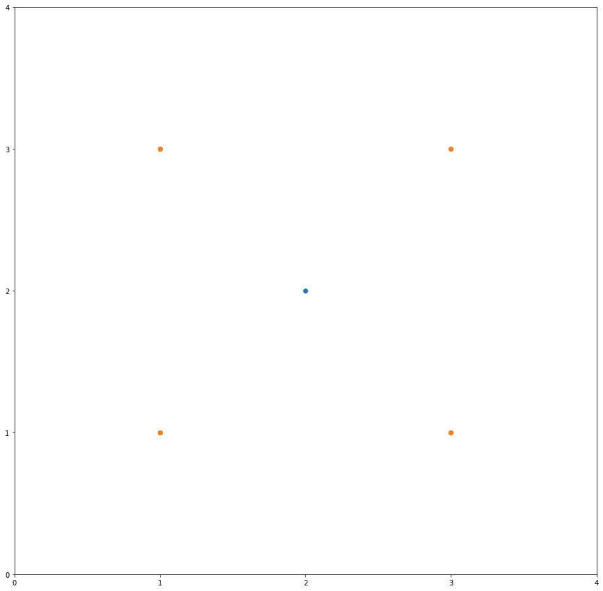

# Minimum Area Rectangle

### Problem description

Given a set of points in the xy-plane, determine the minimum area of a rectangle formed from these points, with sides parallel to the x and y axes.

If there isn't any rectangle, return 0.

 

### Example 1:

Input: [[1,1],[1,3],[3,1],[3,3],[2,2]]

Output: 4

### Example 2:

Input: [[1,1],[1,3],[3,1],[3,3],[4,1],[4,3]]

Output: 2

### Note:

- 1 <= points.length <= 500
- 0 <= points[i][0] <= 40000
- 0 <= points[i][1] <= 40000
All points are distinct.

### My Solution Strategy
1. Find mapping for all x to {y1, y2, ...} and all y to {x1, x2, ...} with one pass.
2. Choose the x or y mapping for next step: the one with less keys.
3. Iterate through all combinations of key pairs (for example, we choosed mapping of x in last step)
4. For each pair of (x1, x2), sort the intersection of the 2 set: mapping[x1], mapping[x2], find the least gap amongst all the adjacent y and calculate the area (|x1-x2| * (y2-y1))
5. Return the minimum area

### Time complexity
O(n2), worst case
